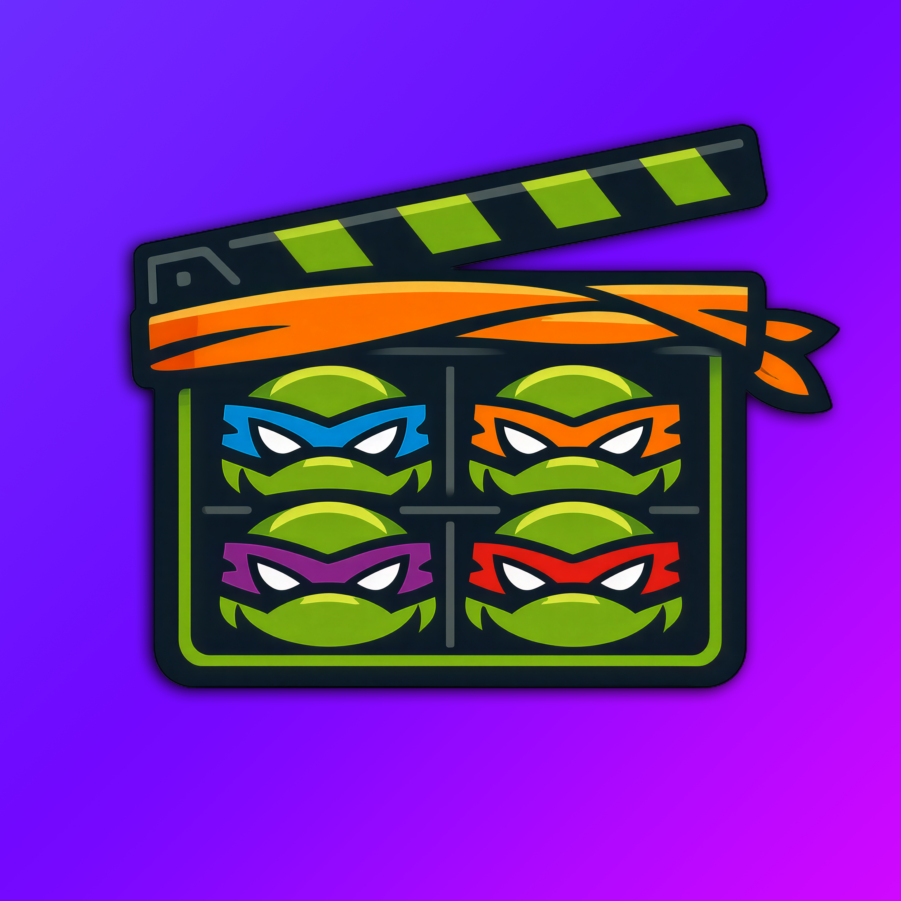

# Cowabunga Jellyfin Companion



Единый плагин для **Jellyfin Server 12.0** (.NET 10), объединяющий Smart Resolver, Choose your Meta и Cowabunga Custom Artwork.

## Модули

С версии 1.0.7 задача **«Объединить связи актёров по внешним ID»** исправляет раздельные карточки людей с разным написанием имени, когда внешние ID подтверждают совпадение. Выполняется каждые пять минут вне сканирования и доступна для ручного запуска в планировщике задач. Требует включённых метаданных и локализации людей для выбранных медиатек. Связи переносятся на существующую русскую карточку с сохранением ролей; прежние карточки и пользовательские отметки плагин не удаляет. Избранное старой карточки не переносится автоматически. Конфликтующие ID и блокировки исключают объединение.

В версии 1.0.1 исправлен язык изображений коллекций: Choose your Meta отдаёт постеры и логотипы выбранного языка, а другой язык использует только при отсутствии выбранного (отдельно для каждого типа). Это не позволяет Jellyfin поднять русский постер выше английского из-за русского языка метаданных. Приоритет изображений из облака Custom Artwork сохраняется. В ручном выборе этого провайдера запасной язык также скрыт, пока есть выбранный.

- **Smart Resolver:** фильмы по имени видеофайла, вложенные папки фильмов, альтернативные версии и части, вложенные сериалы, режимы YearPrefix / AnySingleNestedSeries / CustomRegex, предварительная проверка папок и история решений. Медиафайлы не перемещаются и не переименовываются.
- **Choose your Meta:** русские названия, описания и другие поля фильмов, сериалов, сезонов и эпизодов; английский текст как резерв; локализация людей; идентификация и локализация коллекций; отдельный языковой приоритет постеров и логотипов российских/зарубежных фильмов и коллекций. Используются TMDB, Wikidata и Fanart.tv. Языковой подбор изображений можно отключить отдельно от текста.
- **Custom Artwork:** существующий облачный индекс Cowabunga schema v1/v2, проверка ревизии, сопоставление по идентификаторам и именам релизов, стабильные ключи пользовательских коллекций, постеры и логотипы фильмов/сериалов/сезонов/коллекций. Режим хранения в Jellyfin либо рядом с медиа; загрузки ограничены по размеру, кастомные файлы проверяются по SHA-256.

## Установка

Каталог плагинов: **CowabungaAddons**. В Jellyfin откройте **Панель управления → Плагины → Репозитории** и добавьте:

```text
https://raw.githubusercontent.com/Lootfullin/cowabunga-addons/main/manifest.json
```

Затем установите **Cowabunga Jellyfin Companion** из каталога и перезапустите сервер. Если CowabungaAddons уже добавлен со старым адресом `jellyfin-smart-resolver`, замените его URL новым, чтобы не дублировать каталог. Старые плагины для Jellyfin 10.11 сохранены в новом каталоге.

Исходники и релизы: https://github.com/Lootfullin/cowabunga-jellyfin-companion. Альтернативная ручная установка:

1. Распакуйте `Cowabunga.Jellyfin.Companion_1.0.0_jellyfin-12.0.zip` в отдельную папку `Cowabunga Jellyfin Companion` внутри каталога `plugins` вашего Jellyfin. В этой папке должны оказаться `Jellyfin.Plugin.Companion.dll` и `meta.json`.
2. Перезапустите Jellyfin. Откройте **Панель управления → Плагины → Cowabunga Jellyfin Companion**.
3. Отметьте нужные модули и медиатеки, сохраните настройки. При первой установке ни одна медиатека не выбрана.
4. Перейдите по ссылкам модулей для подробных настроек. Для распознавания и метаданных выполните сканирование/обновление выбранных медиатек. Кнопка «Сохранить и проверить» на странице Custom Artwork запускает проверку индекса; изменение языковых предпочтений использует общую очередь изображений.

Типичные каталоги плагинов: Windows — `%ProgramData%\Jellyfin\Server\plugins`; официальный Docker — `/config/plugins`; Linux — `/var/lib/jellyfin/plugins`. Используйте фактический каталог данных вашей установки.

Пакет предназначен для Jellyfin 12.0, не для 10.11. Установку на рабочий сервер и публикацию в каталоге эта версия исходников автоматически не выполняет.

## Переход с трёх плагинов

1. Сохраните резервную копию данных Jellyfin перед переходом на сервер 12.0.
2. Установите Companion и нажмите **«Импортировать прежние настройки»**. Импорт читает `Jellyfin.Plugin.SmartResolver.xml`, `RussianMetadata.xml` и `Jellyfin.Plugin.CustomArtwork.xml` из стандартного каталога конфигураций.
3. Импорт также переносит доступный индекс, стабильные сопоставления коллекций и учёт файлов, созданных Custom Artwork. Уже существующие файлы состояния Companion не перезаписываются. Список выбранных медиатек не расширяется.
4. Удалите прежние три плагина через Jellyfin и перезапустите сервер. Пока прежний плагин загружен, соответствующий модуль Companion приостановлен; другие модули могут работать. Companion сам не удаляет старые плагины.
5. Выберите медиатеки и проверьте настройки модулей. Если исходные файлы конфигурации или состояния уже удалены, импортировать их нельзя: восстановите их из резервной копии в прежние каталоги либо настройте плагин заново.

Для прежних установок с нестандартной раскладкой каталогов проверьте перенос состояния до удаления старых папок. Секреты импорта остаются в конфигурации Jellyfin, не выводятся в ответ API импорта.

## Правила применения

- Главный выключатель останавливает все модули. Каждый модуль имеет собственный выключатель; внутри выбранной медиатеки также можно включить только часть модулей.
- Привязка хранится по ID медиатеки: переименование не сбрасывает её. Новые медиатеки исключены, если не включён отдельный флажок автоматического подключения.
- При пересекающихся путях побеждает более конкретный корень. Для одного пути в нескольких медиатеках разрешение требуется во всех медиатеках с одинаково конкретным корнем.
- **Коллекции настраиваются отдельно для всего сервера**, поскольку одна коллекция может объединять несколько медиатек. По умолчанию оба переключателя коллекций выключены.
- Отключение модуля сохраняет уже записанные метаданные и изображения. Оно не откатывает результаты предыдущей работы.
- На страницах модулей задаются общие детальные настройки. Таблица медиатек задаёт область действия модулей; отдельные языковые профили для каждой медиатеки в 1.0 не реализованы.

## Изображения и согласование модулей

Фоновые изменения идут через одну сохраняемую очередь. Перед записью повторно проверяются модуль и медиатека. Кастомное изображение имеет приоритет над языковым подбором; остальные включённые источники Jellyfin используются, если кастомного файла нет. Обложка и логотип выбираются отдельно.

Ошибка облака не считается удалением изображения из индекса. Имеющееся изображение сохраняется; повторные попытки начинаются через минуту, затем интервал растёт до суток. Очередь и сведения о происхождении изображений сохраняются между перезапусками.

По умолчанию фоновые задачи заменяют только известные Companion изображения с неизменившимся содержимым. Вручную заменённое или неизвестное изображение сохраняется. Чтобы заменить существующие изображения других источников, явно включите соответствующую настройку на главной странице. Заблокированные карточки общая очередь не изменяет.

Файлы рядом с медиа защищены отдельно. Их замена разрешается на странице Custom Artwork. В режиме хранения рядом с медиа удалённый Custom Artwork provider отключён для фильмов, сериалов и сезонов; файлы пишет локальный модуль. Коллекции всегда хранят изображения внутри Jellyfin. При переходе обратно к внутреннему хранению удаляются только управляемые файлы с совпадающим хешем и только в разрешённых медиатеках.

Эти правила относятся к действиям Companion. Ручная принудительная замена изображений средствами Jellyfin и работа сторонних плагинов подчиняются их собственным правилам.

## Сборка и проверки

Нужны .NET SDK 10 и Node.js для проверки страниц настроек:

```powershell
dotnet test tests/Companion.Tests/Companion.Tests.csproj -c Release
node scripts/test-pages.mjs
python scripts/package.py
```

Если установлен только .NET Runtime, сборку можно выполнить в Docker:

```powershell
docker run --rm -v "${PWD}:/src" -v companion-nuget:/root/.nuget/packages -w /src mcr.microsoft.com/dotnet/sdk:10.0 dotnet test tests/Companion.Tests/Companion.Tests.csproj -c Release
node scripts/test-pages.mjs
python scripts/package.py
```

`package.py` упаковывает ранее собранную Release DLL и проверяет структуру архива; результат находится в `artifacts/`. Сам скрипт не заменяет запуск тестов. Пакеты Jellyfin исключены из runtime-зависимостей архива — их предоставляет сервер.

Тесты включают исходные проверки распознавания, локализации и сопоставления artwork, а также все восемь сочетаний модулей, область действия медиатек, общую очередь, защиту ручных изображений, отказ облака и миграцию конфигурации. Подробности выполненной проверки — в `VALIDATION.md`.

Администраторские API: `/CowabungaCompanion/Status`, `/CowabungaCompanion/ImportLegacy`, `/SmartResolver/Preview`, `/SmartResolver/History`, `/ChooseYourMeta/ConfigureLibraries`, `/ChooseYourMeta/RefreshArtworkPreferences`, `/ChooseYourMeta/Status`.

## Исходники и лицензии

Исходные ревизии перечислены в `UPSTREAM.md`. Объединённый проект распространяется под AGPL-3.0-only, как исходный Custom Artwork. Исходные уведомления GPL-3.0 для Smart Resolver и MIT для Choose your Meta сохранены в файлах `*-LICENSE`. Пространства имён исходных алгоритмов сохранены для удобства сопоставления изменений; загружаемый плагин и регистрация сервисов — одни.
